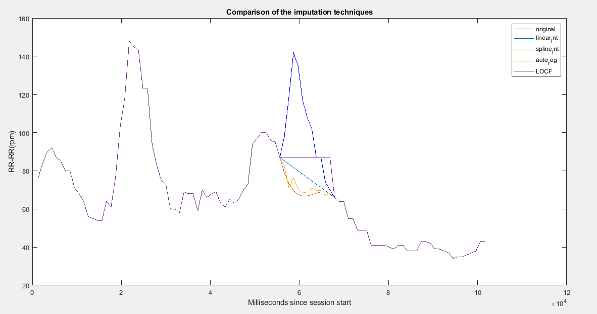

# COMPARISON OF IMPUTATION TECHNIQUES FOR RECONSTRUCTION OF BIOMEDICAL SIGNALS
## Introduction 
In this project, the missing data of the biomedical signals is reconstructed using imputation techniques and the comparison is made by finding the errors between the original signal and the reconstructed signal. Handling missing data in real time is very important but difficult for the researchers to find different ways to solve the problem. To handle the missing data 4 techniques are used in this project. 
1. Linear interpolation 
2. Cubic spline interpolation 
3. Last Observation Carried Forward (LOCF) 
4. Autoregressive model 

The reconstructed signal using 4 techniques are compared by finding the error between the original signal and the reconstructed signal. Two experiments are performed to find the average error. One uses random missing values starting from random point and the other experiments uses consecutive missing values starting from a random point. The graphs for the different techniques and for the average errors are plot in the MATLAB software. 

 

Error calculation: 
                 
Where, 
𝑥_𝑔 [𝑛]  = Original signal 
𝑥_𝑟 [𝑛]  = Reconstructed signal 
𝑇 = length of the signal 𝑥_𝑔 [𝑛] 
𝑁 = number of removed random points
	where, 𝑁∈[1,𝑇/3]

### Calculating RMS error using 300 trials for random and consecutive missing data
 
 

### Calculating RMS error using 3000 trials for random and consecutive missing data
 
 

## Conclusion 
* Average error is increasing as the number of missing samples increase 
* Average error for missing samples is lower than for missing intervals (with the same number of missing samples) 
* When the missing samples are randomly distributed, linear and cubic interpolations provide better results and slower error growing rate 
* Linear interpolation is the best for randomly missing samples and for short missing intervals, while autoregressive model is better for longer (than 25 samples) missing intervals 
* For long missing intervals, cubic spline has unpredicted behavior and error is higher than with the other methods 

## **References** 
Chadwick N, McMeekin D, Tan T. Classifying eye and head movement artifacts in EEG signals. In: 5th IEEE international conference on digital ecosystems and technologies, 2011. IEEE-DEST 2011; 2011. p. 285–91. 
Fritsch, F. N., and R. E. Carlson. "Monotone Piecewise Cubic Interpolation." SIAM Journal on Numerical Analysis. Vol. 17, 1980, pp.238–246. 
Higham, D. (1992). Monotonic piecewise cubic interpolation, with applications to ODE plotting. Journal of Computational and Applied Mathematics,39(3). doi:10.1016/0377-0427(92)90205-c 
Hussain, M. Z., Irshad, M., Sarfraz, M., & Zafar, N. (2015). Interpolation of Discrete-Time Signals Using Cubic Spline Function. 2015 19th International Conference on Information Visualisation. doi:10.1109/iv.2015.82 
Fung, David S. Methods for the Estimation of Missing Values in Time Series. Edith Cowan University, Edith Cowan University, Research Online, Perth, Western Australia, Perth, Western Australia, 2006. 
Musil, C. M., Warner, C. B., Yobas, P. K., & Jones, S. L. (2002). A Comparison of Imputation Techniques for Handling Missing Data. Western Journal of Nursing Research, 24(7), 815–829. https://doi.org/10.1177/019394502762477004 
Roland Priemer (1991). Introductory Signal Processing. World Scientific. p. 1. ISBN 9971509199. 
Rubin, Donald B. “Inference and Missing Data.” Biometrika, vol. 63, no. 3, 1976, p. 581., doi:10.2307/2335739. 
Wahab, Muhammad. (2017). Interpolation and Extrapolation 
Zhou, Xi-Yu, and Joon S. Lim. “EM Algorithm with GMM and Naive Bayesian to Implement Missing Values.” Advanced Science and Technology Letters, 2014, doi:10.14257/astl.2014.46.01. 
